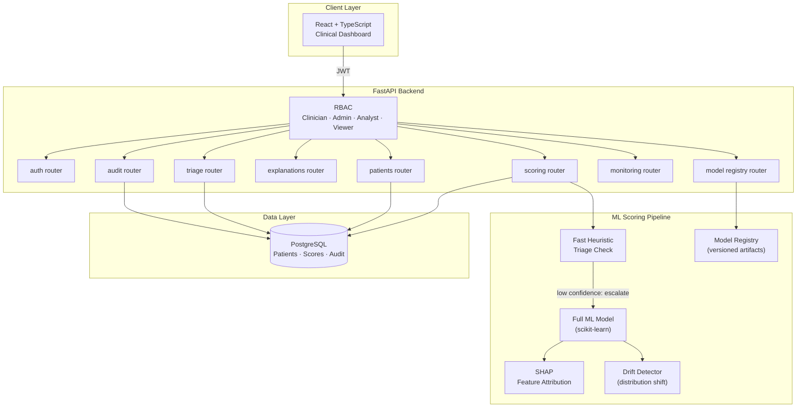

# Cerberus

**Healthcare Risk Prediction & Clinical Intelligence Platform — Portfolio Project**

> A student portfolio project that scores synthetic patient records with explainable ML, surfaces tiered triage queues, and returns per-feature explanations alongside each risk score. Built to demonstrate how clinical-style AI tools should balance predictive signal with interpretability and responsible-ML practice.

> [!IMPORTANT]
> **Not for clinical use.** This is a portfolio / educational project. All data is synthetic. Cerberus is not a medical device, has not been clinically validated, and must not be used for diagnosis, treatment, or any real-world clinical decision-making.

---

## 👋 Recruiter Summary (30 seconds)

- **What it is.** A full-stack FastAPI + React project that predicts three risk targets (30-day readmission, deterioration, adverse event) on synthetic patient records, returns SHAP-style top-factor explanations, and exposes a clinician-style dashboard.
- **Why it matters.** Healthcare AI fails when it can't explain itself. The project foregrounds explainability, fairness slicing, drift monitoring, and a model card — the practices real healthcare ML teams use.
- **Stack.** Python · FastAPI · scikit-learn · SHAP · SQLAlchemy · PostgreSQL/SQLite · pytest · React + Vite · Docker Compose · GitHub Actions.
- **Built by** [Ryan Bush](https://github.com/RyanJBush) — University of Maryland, Information Science.
- **Resume bullets** → [`docs/resume-bullets.md`](docs/resume-bullets.md) · **API** → [`docs/api.md`](docs/api.md) · **Model card** → [`MODEL_CARD.md`](MODEL_CARD.md).

---

## 🎯 Problem & Approach

Healthcare AI has a trust problem: a model that says “high risk” without explaining why is unusable in a clinical setting. Cerberus tackles that directly:

- **Tiered scoring** — a fast heuristic check runs first and only escalates to the full ML model when confidence is low, demonstrating a real latency/accuracy pattern.
- **SHAP-style explainability** — every risk score is returned with a per-feature contribution breakdown, reason codes, and a plain-language rationale.
- **Drift monitoring scaffold** — `GET /api/monitoring/drift` compares request-time prediction distributions against the training baseline (illustrative on synthetic traffic).
- **Model registry & training runs** — versioned model artifacts with evaluation-run history so every score is traceable to a model version.
- **Fairness slicing** — `scripts/fairness_eval.py` reports per-slice positive-prediction rate and risk-category distribution on a synthetic cohort.

---

## 🏗️ Architecture



---

## 📷 Features

- **Tiered risk scoring** — fast heuristic triage + full ML scoring pipeline with batch job support
- **SHAP explainability** — per-patient feature contribution breakdowns and explanation history
- **Triage queue & watchlist** — prioritized patient queues for clinician review
- **Model evaluation & registry** — comparison runs, training history, and version-controlled artifacts
- **Drift monitoring scaffold** — distribution-shift summary vs. the training baseline (illustrative on synthetic traffic)
- **Fairness slice evaluation** — offline script reporting positive-prediction-rate disparities on a synthetic cohort
- **RBAC with 4 roles** — Clinician, Admin, Analyst, Viewer with audit logging
- **Clinical-style dashboard** — React + Vite + Tailwind UI with Risk Analysis and Patient Detail views
- **CLI scoring** — `scripts/predict_cli.py` scores a synthetic patient without running the API
- **Docker Compose** — one-command local stack with synthetic demo-data bootstrap

---

## 🛠️ Tech Stack

| Layer | Technology |
|---|---|
| Backend API | FastAPI + SQLAlchemy + PostgreSQL |
| ML & Explainability | scikit-learn + SHAP |
| Auth | JWT with RBAC (4 roles) |
| Frontend | React + Vite + Tailwind CSS |
| Infra | Docker Compose + GitHub Actions CI |

---

## 🚀 Quick Start

### Prerequisites
- Docker + Docker Compose
- Python 3.11+
- Node.js 20+

### Docker (Recommended)
```bash
make doctor   # verify prerequisites
make setup    # install dependencies
make dev      # start backend + frontend
# Backend API docs: http://localhost:8000/docs
# Frontend:         http://localhost:5173
```

### Local Development
```bash
cp backend/.env.example backend/.env
cd backend && python -m venv .venv && source .venv/bin/activate
pip install -r requirements.txt && pip install -e ".[dev]"
uvicorn app.main:app --reload --host 0.0.0.0 --port 8000

cd frontend && npm install && npm run dev
```

### Seed Demo Data
```bash
make demo-bootstrap
```

### Quality Checks
```bash
make lint && make test
```

---

## 🗂️ Repository Structure

```
backend/                 FastAPI API, tiered ML scoring, SHAP explainability, RBAC
  app/                   Routers, models, schemas, services
  tests/                 pytest suite (API, services, security, scripts)
frontend/                React + Vite + Tailwind clinical-style dashboard
scripts/
  predict_cli.py         Score a synthetic patient from the command line
  fairness_eval.py       Per-slice fairness report on a synthetic cohort
  bootstrap_demo.sh      One-shot demo bring-up
docs/
  api.md                 Curated API reference and sample payloads
  architecture.md        System architecture notes
  deployment.md          Local-deployment guide
  demo-script.md         Walk-through for a recorded demo
  resume-bullets.md      ATS-friendly bullets mapped to this codebase
.github/workflows/ci.yml ruff + mypy + pytest + frontend build on every push
MODEL_CARD.md            Intended use, metrics, and known limitations
SECURITY.md              Disclosure policy for this portfolio project
```

---

## 🧪 Demo Workflow

```bash
# 1. Start the stack
make setup && make dev

# 2. Seed the synthetic cohort
make demo-bootstrap

# 3. Log in and score a patient
TOKEN=$(curl -s -X POST http://localhost:8000/api/auth/login \
  -H "Content-Type: application/json" \
  -d '{"username":"clinician","password":"clinician123"}' | jq -r .access_token)

curl -s -X POST http://localhost:8000/api/scoring/1 \
  -H "Authorization: Bearer $TOKEN" | jq

# 4. Or score from the CLI (no API required)
python scripts/predict_cli.py --age 72 --bmi 31 --bp 158 --chol 245 --glucose 180 --smoker 1

# 5. Run a fairness slice report on a synthetic cohort
python scripts/fairness_eval.py --n 500 --seed 42
```

---

## 📊 Sample Data

The seeded cohort under `make demo-bootstrap` is **fully synthetic** — generated, not derived from any real patient record. Each row contains: age, BMI, systolic blood pressure, total cholesterol, fasting glucose, smoker flag, review status, and a masked synthetic identifier. There are no real names, MRNs, or any other PHI in this repo.

## 🧪 Model Evaluation

Models are evaluated with: **ROC-AUC**, **PR-AUC**, **Brier score**, **F1**, **precision**, **recall**, and a confusion matrix. See `backend/app/services/evaluation.py` and the model registry endpoints (`GET /api/models`) for training-run history. Because data is synthetic, headline metrics are **illustrative** and not a benchmark.

## ⚖️ Fairness & Bias

`scripts/fairness_eval.py` reports per-slice positive-prediction rate, mean risk score, and risk-category distribution on a synthetic cohort with two demographic groups. The script is deliberately offline — it demonstrates that fairness slicing has been *considered and measured*, not that the model is fair on real populations. See [`MODEL_CARD.md`](MODEL_CARD.md) for known biases and limitations.

## 🔐 Data Privacy & Ethics

- **No real patient data.** Everything in this repo is synthetic.
- **No PHI is collected, stored, or transmitted.** The seeded cohort uses masked identifiers and synthetic vitals only.
- **Not HIPAA-scoped.** This project is not designed or validated for handling protected health information.
- **Human-in-the-loop framing.** Every scoring response includes top-factor explanations and reason codes so a reviewer can disagree with the model.
- **Clinical-decision-support disclaimer.** Cerberus is not a CDS system, not a medical device, and must not be used to inform real clinical decisions.

---

## 👤 Demo Credentials

| Username | Password | Role |
|---|---|---|
| `clinician` | `clinician123` | Clinician |
| `admin` | `admin123` | Admin |
| `analyst` | `analyst123` | Analyst |
| `viewer` | `viewer123` | Viewer |

---

## 📝 Key Learnings

- Explainability isn't optional in healthcare AI — a model without interpretable outputs is a liability, not an asset
- Tiered scoring pipelines (fast heuristics → full ML) are a real pattern for balancing latency and accuracy under load
- Drift monitoring is a first-class concern; a model accurate at training time can degrade silently and needs continuous observation
- Fairness slicing on synthetic data is a useful muscle to build — the technique transfers; the conclusions don't

---

## ⚠️ Limitations & Future Work

**Current limitations**
- Synthetic / de-identified demo data only — no clinical signal, no real outcomes.
- Not deployed; runs locally via `make dev` or Docker Compose.
- Drift and fairness metrics are illustrative on synthetic traffic; they are not statements about real-world performance.
- No clinical validation, regulatory review, or HIPAA scoping has been performed.
- The "tiered" heuristic and the full model are both small, hand-tuned models — they exist to show the *pattern*, not to compete with a real clinical risk score.

**Planned / future work**
- Calibration evaluation (reliability diagram, calibration error) per target.
- Counterfactual explanation alongside SHAP attributions.
- Containerize training as a separate job and version artifacts in `mlruns/`.
- Replace the synthetic generator with a public, properly-licensed dataset (e.g. MIMIC-style demo extracts) under a clear DUA.
- More fairness metrics: equal-opportunity difference, calibration-by-group.

---

## 📚 Further Reading In This Repo

- [`docs/api.md`](docs/api.md) — curated API reference with sample payloads
- [`docs/architecture.md`](docs/architecture.md) — system architecture notes
- [`docs/resume-bullets.md`](docs/resume-bullets.md) — ATS-friendly bullets mapped to features in this codebase
- [`MODEL_CARD.md`](MODEL_CARD.md) — intended use, metrics, and known limitations
- [`SECURITY.md`](SECURITY.md) — disclosure policy

---

## 📄 License

MIT — see [LICENSE](LICENSE).
