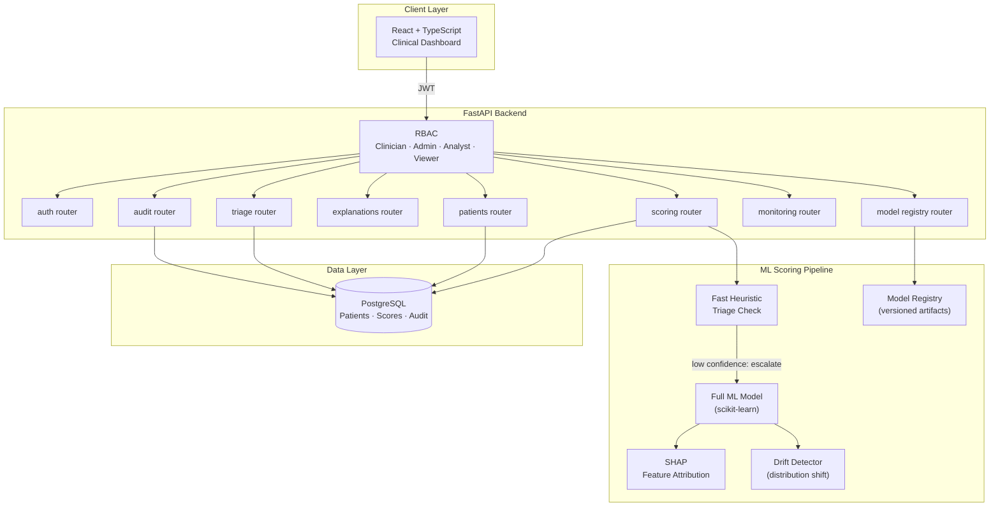

# Nova AI

> A production-style clinical intelligence platform that scores patient risk with explainable ML, surfaces tiered triage queues, and provides clinicians with SHAP-backed explanations — built to reflect how real healthcare AI tools must balance predictive accuracy with interpretability.

---

## 🎯 What I Built & Why

Healthcare AI has a trust problem: a model that says “high risk” without explaining why is unusable in a clinical setting. I built Nova AI to tackle that directly:

- **Tiered ML scoring** — patients are scored through a pipeline that runs fast heuristic checks first and escalates to a full ML model only when needed, balancing latency with accuracy
- **SHAP explainability** — every risk score is accompanied by a per-feature contribution breakdown that clinicians can read and act on
- **Model monitoring & drift detection** — `GET /api/monitoring/drift` tracks when live prediction distributions diverge from training baselines
- **Model registry & training runs** — version-controlled model artifacts with evaluation run history, so every deployed model is traceable

---

## 🏗️ Architecture



---

## 📷 Features

- **Tiered risk scoring** — fast heuristic triage + full ML scoring pipeline with batch job support
- **SHAP explainability** — per-patient feature contribution breakdowns and explanation history
- **Triage queue & watchlist** — prioritized patient queues for clinician review
- **Model evaluation & registry** — comparison runs, training history, and version-controlled artifacts
- **Drift monitoring** — live detection of prediction distribution shifts vs. training baseline
- **RBAC with 4 roles** — Clinician, Admin, Analyst, Viewer with audit logging
- **Clinical dashboard** — React + Vite + Tailwind UI with Risk Analysis and Patient Detail views
- **Docker Compose** — one-command local stack with demo data bootstrap

---

## 🛠️ Tech Stack

| Layer | Technology |
|---|---|
| Backend API | FastAPI + SQLAlchemy + PostgreSQL |
| ML & Explainability | scikit-learn + SHAP |
| Auth | JWT with RBAC (4 roles) |
| Frontend | React + Vite + Tailwind CSS |
| Infra | Docker Compose + GitHub Actions CI |

---

## 🚀 Quick Start

### Prerequisites
- Docker + Docker Compose
- Python 3.11+
- Node.js 20+

### Docker (Recommended)
```bash
make doctor   # verify prerequisites
make setup    # install dependencies
make dev      # start backend + frontend
# Backend API docs: http://localhost:8000/docs
# Frontend:         http://localhost:5173
```

### Local Development
```bash
cp backend/.env.example backend/.env
cd backend && python -m venv .venv && source .venv/bin/activate
pip install -r requirements.txt && pip install -e ".[dev]"
uvicorn app.main:app --reload --host 0.0.0.0 --port 8000

cd frontend && npm install && npm run dev
```

### Seed Demo Data
```bash
make demo-bootstrap
```

### Quality Checks
```bash
make lint && make test
```

---

## 🗂️ Repository Structure

```
backend/    FastAPI API, tiered ML scoring, SHAP explainability, drift monitoring, RBAC, tests
frontend/   React clinical dashboard
docs/       Architecture, deployment guide, demo script
```

---

## 👤 Demo Credentials

| Username | Password | Role |
|---|---|---|
| `clinician` | `clinician123` | Clinician |
| `admin` | `admin123` | Admin |
| `analyst` | `analyst123` | Analyst |
| `viewer` | `viewer123` | Viewer |

---

## 📝 Key Learnings

- Explainability isn’t optional in healthcare AI — a model without interpretable outputs is a liability, not an asset
- Tiered scoring pipelines (fast heuristics → full ML) are a real production pattern for balancing latency and accuracy under load
- Drift monitoring is a first-class concern; a model accurate at training time may degrade silently in production without it

---

## 📄 License

MIT
