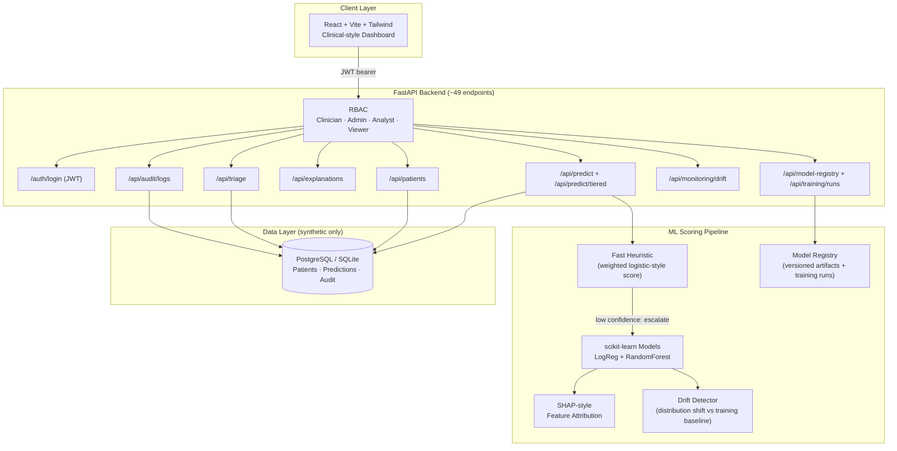

# Cerberus

**Healthcare Risk Prediction & Clinical Intelligence Platform — Portfolio Project**

> A student portfolio project that scores synthetic patient records with explainable ML, surfaces tiered triage queues, and returns per-feature explanations alongside each risk score. Built to demonstrate how clinical-style AI tools should balance predictive signal with interpretability and responsible-ML practice.

> [!IMPORTANT]
> **Not for clinical use.** This is a portfolio / educational project. All data is **synthetic — no PHI, no real patient records**. Cerberus is not a medical device, has not been clinically validated, is not HIPAA-scoped, and must not be used for diagnosis, treatment, or any real-world clinical decision-making.

---

## ⚡ Recruiter Demo in 2 Minutes

```bash
# 1. Clone and start the stack (Docker recommended)
git clone https://github.com/RyanJBush/Healthcare-risk-prediction-and-clinical-intelligence-platform.git
cd Healthcare-risk-prediction-and-clinical-intelligence-platform
make setup && make dev

# 2. Seed the synthetic cohort and run batch scoring (in a second terminal)
make demo-bootstrap

# 3. Open in your browser
#    Frontend dashboard:   http://localhost:5173    (login: clinician / clinician123)
#    FastAPI Swagger docs: http://localhost:8000/docs

# 4. (Optional) Score a synthetic patient from the CLI with no API running
python scripts/predict_cli.py --age 72 --bmi 31 --bp 158 --chol 245 --glucose 180 --smoker 1

# 5. (Optional) Run the fairness slice report
python scripts/fairness_eval.py --n 500 --seed 42
```

Prefer to skim? Jump to [Project Snapshot](#-project--technical-snapshot) · [What This Demonstrates](#-what-this-project-demonstrates) · [Screenshots](#-screenshots--demo) · [Limitations](#-limitations--future-work) · [Resume Bullets](#-resume-bullets).

---

## 📋 Project / Technical Snapshot

| | |
|---|---|
| **Project name** | Cerberus |
| **Type** | Portfolio / educational project (not deployed, not validated) |
| **Status** | Active development — local-run only |
| **Data** | 100% synthetic, generated in-repo (no PHI, no real records) |
| **Risk targets** | 3 — 30-day readmission, inpatient deterioration, adverse event |
| **ML stack** | scikit-learn (LogisticRegression, RandomForestClassifier) + SHAP + a weighted heuristic for tiered scoring |
| **Base feature set** | 6 input features (age, BMI, systolic BP, cholesterol, glucose, smoker) plus derived signals |
| **Backend** | FastAPI + SQLAlchemy + PostgreSQL/SQLite, ~49 REST endpoints |
| **Auth** | JWT + RBAC across 4 roles (Clinician, Admin, Analyst, Viewer) |
| **Frontend** | React 19 + Vite + Tailwind CSS + Recharts (JavaScript) |
| **Tests** | pytest suite — 11 backend test files (API, ML, services, security, scripts) |
| **CI** | GitHub Actions — ruff lint, mypy type-check, pytest, frontend lint + Vite build |
| **Infra** | Docker Compose (db + backend + frontend), Makefile wrapper |
| **License** | MIT |

---

## 🎯 What This Project Demonstrates

Cerberus is built to show, with working code, a handful of practices that real healthcare ML teams care about. Each one maps to files in this repo:

- **Tiered scoring as a latency/accuracy pattern** — a fast weighted heuristic runs first; only low-confidence cases escalate to the full ML scorer (`backend/app/ml.py`, `POST /api/predict/tiered`).
- **SHAP-style explainability per prediction** — every score returns top-factor contributions, reason codes, and a plain-language rationale (`GET /api/explanations/{patient_id}`).
- **Model registry + versioned training runs** — every score is traceable to a model version (`GET /api/model-registry`, `POST /api/training/runs`, `backend/app/services/training.py`).
- **Drift monitoring scaffold** — request-time prediction distributions compared against the training baseline (`GET /api/monitoring/drift`).
- **Offline fairness slicing** — per-slice positive-prediction rate and risk-category distribution on a synthetic cohort (`scripts/fairness_eval.py`).
- **RBAC + request-level audit logging** — four roles enforced via FastAPI dependencies, audit rows persisted on key actions (`backend/app/security.py`, `GET /api/audit/logs`).
- **Model card & responsible-ML docs** — intended use, metrics, biases, and limitations documented up front (`MODEL_CARD.md`).
- **Test-first backend** — 11 pytest modules cover API routes, ML behavior, training, evaluation, security, seeding, and the CLI scripts.

---

## 🏗️ Architecture



More detail: [`docs/architecture.md`](docs/architecture.md).

---

## 📸 Screenshots / Demo

> Screenshots are **UI / portfolio / design previews** of the local dashboard rendered against synthetic data. They are not from a deployed or clinical environment.

Place captures under `docs/screenshots/` (see [`docs/screenshots/README.md`](docs/screenshots/README.md) for the recommended shot list and naming scheme). The following views are worth capturing for a recruiter walkthrough:

| View | Suggested filename | What it shows |
|---|---|---|
| Patient cohort dashboard | `docs/screenshots/01-dashboard.png` | KPI tiles, cohort breakdown, recent activity |
| Patient detail / risk score | `docs/screenshots/02-patient-detail.png` | A single patient's tiered risk scores and metadata |
| SHAP-style explanation | `docs/screenshots/03-explanation.png` | Top-factor contributions and reason codes for one score |
| Triage queue | `docs/screenshots/04-triage-queue.png` | Prioritized alert queue / watchlist |
| Risk analysis / model comparison | `docs/screenshots/05-risk-analysis.png` | LogReg vs Random Forest comparison and threshold view |
| Fairness slice report | `docs/screenshots/06-fairness-report.png` | Output of `scripts/fairness_eval.py` on a synthetic cohort |
| Model card | `docs/screenshots/07-model-card.png` | Rendered [`MODEL_CARD.md`](MODEL_CARD.md) — intended use, metrics, limitations |
| FastAPI Swagger docs | `docs/screenshots/08-api-docs.png` | `http://localhost:8000/docs` with endpoints expanded |

A scripted walkthrough is in [`docs/demo-runbook.md`](docs/demo-runbook.md).

---

## 🛠️ Key Technical Highlights

- **Tiered ML inference path** — a hand-tuned weighted score short-circuits the obvious cases; only ambiguous ones run the full scikit-learn pipeline. Implemented in `backend/app/ml.py::predict_tiered`.
- **SHAP integration for per-prediction explanations** — `shap==0.46.0` is pinned; the API returns per-feature contributions, ranked top factors, and reason codes for each score.
- **Multi-target risk modeling** — one pipeline, three configured targets (readmission, deterioration, adverse event), each with its own weights and thresholds (`TARGET_CONFIGS` in `backend/app/ml.py`).
- **Model registry with training-run history** — `POST /api/training/runs` trains a model on the synthetic dataset and persists a `TrainingRun` row; `GET /api/model-registry` lists registered versions.
- **Drift detection scaffold** — `GET /api/monitoring/drift` compares the live request-time feature/score distributions against the training baseline.
- **Offline fairness evaluation** — `scripts/fairness_eval.py` produces per-slice positive-rate, mean risk score, risk-category distribution, and a disparity summary on a fully synthetic cohort.
- **RBAC enforced at the route level** — `require_roles(...)` FastAPI dependency on each protected endpoint; four seeded roles.
- **Audit logging** — `AuditLog` rows written on scoring, training, configuration changes, and patient access — exposed via `GET /api/audit/logs`.
- **One-command demo bootstrap** — `make demo-bootstrap` logs in, loads the seed cohort, runs batch scoring, and prints summary metrics.
- **CI on every push** — ruff, mypy, pytest, frontend lint, and Vite production build, all in [`.github/workflows/ci.yml`](.github/workflows/ci.yml).

---

## 🚀 How to Run Locally

### Prerequisites
- Docker + Docker Compose
- Python 3.11+
- Node.js 20+

### Option A — Docker Compose (recommended)
```bash
make doctor          # verify Python / Node / Docker versions
make setup           # install backend + frontend dependencies
make dev             # build & start db + backend + frontend via docker-compose
# Frontend:         http://localhost:5173
# Backend / Swagger: http://localhost:8000/docs
```

### Option B — Native local processes
```bash
cp backend/.env.example backend/.env
cd backend && python -m venv .venv && source .venv/bin/activate
pip install -r requirements.txt && pip install -e ".[dev]"
uvicorn app.main:app --reload --host 0.0.0.0 --port 8000

cd ../frontend && npm install && npm run dev
```

### Seed Demo Data
```bash
make demo-bootstrap   # logs in as admin, loads synthetic cohort, runs batch scoring
```

### Quality Checks
```bash
make lint && make test
```

### Demo Credentials (synthetic, local-only)

| Username | Password | Role |
|---|---|---|
| `clinician` | `clinician123` | Clinician |
| `admin` | `admin123` | Admin |
| `analyst` | `analyst123` | Analyst |
| `viewer` | `viewer123` | Viewer |

---

## 🗂️ Repository Structure

```
backend/                 FastAPI API, tiered ML scoring, SHAP explainability, RBAC
  app/                   Routers, models, schemas, services
  tests/                 pytest suite (API, services, security, ML, scripts)
frontend/                React + Vite + Tailwind clinical-style dashboard (JavaScript)
scripts/
  predict_cli.py         Score a synthetic patient from the command line
  fairness_eval.py       Per-slice fairness report on a synthetic cohort
  bootstrap_demo.sh      One-shot demo bring-up
docs/
  architecture.md        System architecture notes
  api.md                 Curated API reference and sample payloads
  demo-runbook.md        Step-by-step walkthrough for a recorded or live demo
  resume-bullets.md      ATS-friendly bullets mapped to this codebase
  screenshots/README.md  Suggested screenshots and naming convention
  deployment.md          Local-deployment notes
.github/workflows/ci.yml ruff + mypy + pytest + frontend lint + Vite build on every push
MODEL_CARD.md            Intended use, metrics, and known limitations
SECURITY.md              Disclosure policy for this portfolio project
```

---

## 📊 Sample Data & Evaluation

The cohort seeded by `make demo-bootstrap` is **fully synthetic** — generated, not derived from any real patient record. Each row contains: age, BMI, systolic blood pressure, total cholesterol, fasting glucose, smoker flag, review status, and a masked synthetic identifier. There are **no real names, MRNs, or any other PHI** in this repo or in the seed generator.

Models are evaluated with **ROC-AUC**, **PR-AUC**, **Brier score**, **F1**, **precision**, **recall**, and a confusion matrix (`backend/app/services/evaluation.py`). Because the data is synthetic, headline metrics are **illustrative** — they show the evaluation pipeline works, not that the model is good on real patients.

---

## ⚖️ Fairness, Drift & Responsible-ML Notes

- `scripts/fairness_eval.py` reports per-slice positive-prediction rate, mean risk score, and risk-category distribution on a synthetic cohort with two demographic groups, plus a disparity summary. The script is deliberately offline — it demonstrates that fairness slicing has been *considered and measured*, not that the model is fair on real populations.
- `GET /api/monitoring/drift` compares request-time prediction distributions against the training baseline. With no real production traffic, the values are illustrative.
- See [`MODEL_CARD.md`](MODEL_CARD.md) for documented biases and limitations.

---

## ⚠️ Limitations & Future Work

### Limitations (today)

| Area | Limitation |
|---|---|
| Data | 100% synthetic — no clinical signal, no real outcomes, no PHI ever. |
| Validation | No clinical validation, no regulatory review, not a medical device, not HIPAA-scoped. |
| Models | Hand-tuned weighted heuristic + small scikit-learn baselines (LogReg, RandomForest) on a synthetic dataset — illustrate the *pattern*, not state-of-the-art performance. |
| Features | 6 base inputs (age, BMI, systolic BP, cholesterol, glucose, smoker) plus a few derived signals — not a real clinical feature set. |
| Deployment | Local-only via Docker Compose / `make dev` — no production hosting. |
| Drift / fairness | Metrics are computed on synthetic traffic and a synthetic cohort; conclusions do not transfer to real populations. |
| Frontend | React 19 + Vite + Tailwind in **JavaScript** (not TypeScript) — kept intentionally lightweight for portfolio review. |
| Security | Demo passwords are seeded for local use only; the demo `SECRET_KEY` in `docker-compose.yml` is a placeholder and must be rotated for any non-local use. |

### Planned / future work
- Calibration evaluation (reliability diagram, calibration error) per target.
- Counterfactual explanations alongside SHAP attributions.
- Containerize training as a separate job and version artifacts in `mlruns/`.
- Replace the synthetic generator with a properly-licensed public dataset (e.g. MIMIC-style demo extracts) under a clear DUA.
- More fairness metrics: equal-opportunity difference, calibration-by-group.
- Migrate the frontend to TypeScript and add route-level code-splitting.

---

## 📌 Resume Bullets

ATS-friendly. Pick 3–5 per role. All claims map to code in this repo. Full list: [`docs/resume-bullets.md`](docs/resume-bullets.md).

- Built a healthcare risk-prediction portfolio platform in **Python (FastAPI) and React** that scores **synthetic** patient records across **three clinical risk targets** (readmission, deterioration, adverse event) with explainable outputs.
- Implemented a **tiered ML scoring pipeline** combining a fast weighted heuristic with **scikit-learn LogisticRegression and RandomForestClassifier** models, escalating to the full model only on low-confidence cases.
- Integrated **SHAP-style feature attribution** so every risk score returns top contributing factors, reason codes, and a plain-language rationale for human-in-the-loop review.
- Designed a **model registry with versioned training runs** (`/api/model-registry`, `/api/training/runs`) so every score is traceable to a specific model version.
- Built a **drift-monitoring endpoint** comparing request-time prediction distributions against the training baseline as a foundation for production model observability.
- Wrote an **offline fairness slice evaluator** (`scripts/fairness_eval.py`) reporting positive-prediction-rate disparities across synthetic demographic groups, with a documented model card.
- Designed a **FastAPI backend with JWT auth, four RBAC roles, and request-level audit logging** across ~49 REST endpoints, documented via OpenAPI/Swagger.
- Set up **GitHub Actions CI** running ruff, mypy, pytest, and a frontend Vite production build on every push; one-command local stack via Docker Compose and a Makefile.

---

## 📈 Project Status

- **Stage:** Active portfolio project, local-run only — not deployed.
- **Maintenance:** Maintained by [Ryan Bush](https://github.com/RyanJBush) (University of Maryland, Information Science) as a learning / portfolio artifact.
- **CI:** GitHub Actions runs ruff + mypy + pytest + frontend Vite build on every push to `main` and on PRs.
- **What's stable:** API surface, RBAC, tiered scoring path, SHAP-style explanations, model registry, fairness/drift scripts, Docker Compose stack.
- **What's intentionally scoped down:** clinical validation, deployment, TypeScript migration, calibration metrics, real datasets.

---

## 🔐 Data Privacy & Ethics

- **No real patient data.** Everything in this repo is synthetic.
- **No PHI is collected, stored, or transmitted.** The seeded cohort uses masked identifiers and synthetic vitals only.
- **Not HIPAA-scoped.** This project is not designed or validated for handling protected health information.
- **Human-in-the-loop framing.** Every scoring response includes top-factor explanations and reason codes so a reviewer can disagree with the model.
- **Clinical-decision-support disclaimer.** Cerberus is not a CDS system, not a medical device, and must not be used to inform real clinical decisions.

---

## 📚 Further Reading In This Repo

- [`docs/architecture.md`](docs/architecture.md) — system architecture notes
- [`docs/api.md`](docs/api.md) — curated API reference with sample payloads
- [`docs/demo-runbook.md`](docs/demo-runbook.md) — step-by-step demo walkthrough
- [`docs/resume-bullets.md`](docs/resume-bullets.md) — ATS-friendly bullets mapped to features in this codebase
- [`docs/screenshots/README.md`](docs/screenshots/README.md) — recommended screenshot shot list
- [`MODEL_CARD.md`](MODEL_CARD.md) — intended use, metrics, and known limitations
- [`SECURITY.md`](SECURITY.md) — disclosure policy

---

## 📄 License

MIT — see [LICENSE](LICENSE).
